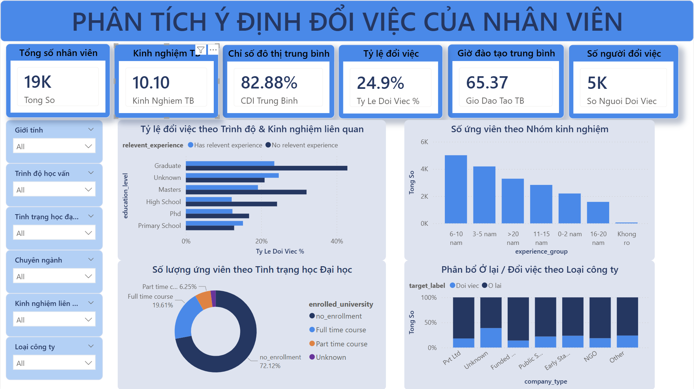

# Employee Job Change Analytics

Dự án phân tích dữ liệu (Data Analytics) end-to-end dự đoán **khả năng một nhân viên / ứng viên đang tìm việc mới** (job change), dựa trên bộ dữ liệu *HR Analytics: Job Change of Data Scientists*.

Dự án mô phỏng quy trình chuẩn của một doanh nghiệp: **Data Cleaning → SQL Analytics → Machine Learning → Báo cáo & Dashboard**.

---

## 1. Mục tiêu nghiệp vụ (Business Problem)

Một công ty tổ chức các khóa đào tạo và muốn biết **học viên/nhân viên nào có ý định nhảy việc** để:
- Tối ưu chi phí tuyển dụng & đào tạo.
- Chủ động giữ chân (retention) các nhóm có nguy cơ rời đi cao.
- Lên kế hoạch nhân sự (workforce planning).

**Biến mục tiêu (`target`)**
| Giá trị | Ý nghĩa |
|--------|---------|
| `1` | Đang tìm việc / có ý định đổi việc |
| `0` | Không có ý định đổi việc |

Tỷ lệ thực tế: **~24.9% có ý định đổi việc** (mất cân bằng lớp ~75/25).

---

## 2. Bộ dữ liệu

- File gốc: [`dataset/aug_train.csv`](dataset/aug_train.csv) — **19,158 dòng × 14 cột**.
- File đã làm sạch + làm giàu cho dashboard (sinh tự động): `dataset/aug_train_cleaned.xlsx` — **19 cột** (thêm nhãn & nhóm).

| Cột | Mô tả |
|-----|-------|
| `enrollee_id` | ID định danh |
| `city`, `city_development_index` | Thành phố & chỉ số phát triển đô thị (0–1) |
| `gender` | Giới tính |
| `relevent_experience` | Có kinh nghiệm liên quan hay không |
| `enrolled_university` | Tình trạng học đại học |
| `education_level` | Trình độ học vấn |
| `major_discipline` | Chuyên ngành |
| `experience` | Số năm kinh nghiệm (`<1`, số, `>20`) |
| `company_size` | Quy mô công ty hiện tại |
| `company_type` | Loại hình công ty |
| `last_new_job` | Số năm kể từ lần đổi việc gần nhất (`never`, số, `>4`) |
| `training_hours` | Số giờ đào tạo đã hoàn thành |
| `target` | **Nhãn cần dự đoán** |

### Các vấn đề chất lượng dữ liệu đã xử lý
| Vấn đề | Cách xử lý |
|--------|-----------|
| `company_size = "Oct-49"` (lỗi Excel tự đổi "10-49" thành ngày tháng) | Khôi phục về `"10-49"` |
| `experience` dạng chuỗi (`>20`, `<1`) | Parse: `>20→21`, `<1→0`, còn lại → số nguyên |
| `last_new_job` dạng chuỗi (`never`, `>4`) | Parse: `never→0`, `>4→5` |
| Thiếu nhiều: `company_type` (32%), `company_size` (31%), `gender` (24%), `major_discipline` (15%) | Categorical → `Unknown`; numeric → impute **trong pipeline** (chỉ fit trên tập train, tránh data leakage) |
| Khoảng trắng thừa / chuỗi rỗng | Chuẩn hóa về `NULL`/`NaN` |

---

## 3. Cấu trúc dự án

```
Employee_Job_Change_Analytics/
├── dataset/
│   ├── aug_train.csv              # Dữ liệu gốc
│   └── aug_train_cleaned.xlsx     # Dữ liệu sạch + làm giàu cho dashboard (sinh tự động)
├── sql/
│   ├── database_creation.sql      # Tạo database
│   ├── table_creation.sql         # Tạo bảng staging + bảng sạch
│   ├── data_cleaning.sql          # Làm sạch dữ liệu bằng SQL (đồng bộ logic với Python)
│   └── analysis_queries.sql       # 12 truy vấn phân tích nghiệp vụ
├── ml/
│   ├── data_preprocessing.py      # Làm sạch + pipeline tiền xử lý + feature engineering + split
│   ├── utils.py                   # Hàm đánh giá (đủ 7 chỉ số) & lưu/đọc model
│   ├── eda.py                     # Thống kê mô tả + trực quan hóa (Mục 3,4,5)
│   ├── train_models.py            # Train 10 model + tối ưu + K-Fold CV + đánh giá test
│   ├── eda_summary.json           # Thống kê mô tả (sinh tự động)
│   ├── results.json               # Toàn bộ kết quả đánh giá (sinh tự động)
│   └── saved_models/best_model.pkl# Pipeline tốt nhất (tiền xử lý + model)
├── report/
│   ├── figures/                   # Biểu đồ sinh tự động (EDA, so sánh, ROC, CM, CV, PCA)
│   └── Bao_cao_du_an.docx         # Báo cáo chi tiết (tiếng Việt, bám 3 mức yêu cầu)
├── dashboard/
│   └── employee_analytics.png        # Ảnh chụp dashboard đã dựng
├── requirements.txt
└── README.md
```

---

## 4. Hướng dẫn chạy (Quickstart)

```bash
# 1. Cài thư viện
pip install -r requirements.txt

# 2. Làm sạch dữ liệu + sinh file cleaned + báo cáo chất lượng dữ liệu
python ml/data_preprocessing.py

# 3. Thống kê mô tả + trực quan hóa (sinh các biểu đồ EDA)
python ml/eda.py

# 4. Train 10 model + tối ưu hóa + K-Fold CV + đánh giá test (sinh results.json + biểu đồ)
python ml/train_models.py

# 5. Sinh báo cáo Word tiếng Việt từ kết quả
python ml/generate_report.py
```

### Phần SQL (PostgreSQL 17)
Mở `psql` **từ thư mục gốc dự án** (để đường dẫn tương đối trong `\copy` hoạt động), rồi chạy lần lượt:

```bash
psql -U postgres -f sql/database_creation.sql
psql -U postgres -d employee_analytics -f sql/table_creation.sql
psql -U postgres -d employee_analytics -c "\copy stg_employee FROM 'dataset/aug_train.csv' WITH (FORMAT csv, HEADER true)"
psql -U postgres -d employee_analytics -f sql/data_cleaning.sql
psql -U postgres -d employee_analytics -f sql/analysis_queries.sql
```

Logic làm sạch trong `data_cleaning.sql` đồng bộ với `ml/data_preprocessing.py` (đã kiểm chứng: số dòng & độ phủ NULL khớp 100% giữa hai tầng).

---

## 5. Phương pháp Machine Learning

- **Tiền xử lý** gói trong `ColumnTransformer` (sklearn), nhúng chung vào mỗi model thành một `Pipeline` → file `.pkl` tự chứa, sẵn sàng triển khai.
  - Numeric: impute median + chuẩn hóa.
  - Ordinal (`education_level`, `company_size`): impute mode + mã hóa theo thứ tự.
  - Nominal: impute `Unknown` + One-Hot (gộp nhóm hiếm). → **110 đặc trưng**.
- **Chống mất cân bằng lớp**: `class_weight="balanced"` / `scale_pos_weight` và **SMOTE** (chỉ trên tập train).
- **Tách dữ liệu**: stratified **60/20/20** (Train/Validation/Test), `random_state=42` (tái lập được).
- **Chống rò rỉ dữ liệu (data leakage)**: mọi thống kê (median, mode, scaler, SMOTE) chỉ fit trên tập train.
- **Mục 1**: 5 model cơ sở (LR, Decision Tree, KNN, Naive Bayes, SVM).
- **Mục 2**: so sánh **10 model** (thêm Random Forest, Gradient Boosting, AdaBoost, XGBoost, LightGBM).
- **Mục 3**: 5 kỹ thuật tối ưu (Feature Engineering, SMOTE, PCA, Hyperparameter Tuning, Ensemble).
- **Cross-Validation**: Stratified K-Fold `k=5`, báo cáo Mean ± Std.

### Chỉ số đánh giá
Vì mục tiêu là *không bỏ sót người sắp nghỉ*, **Recall của lớp 1** và **ROC-AUC** là chỉ số trọng tâm (quan trọng hơn Accuracy đơn thuần do dữ liệu mất cân bằng).

---

## 6. Kết quả model

So sánh 10 model trên tập **Validation** (xem chi tiết trong [`report/Bao_cao_chi_tiet.docx`](report/Bao_cao_chi_tiet.docx) và [`ml/results.json`](ml/results.json)). Model cuối cùng được chọn là **XGBoost + Hyperparameter Tuning**, đánh giá **một lần** trên tập **Test** (hold-out 20%):

| Chỉ số | Accuracy | Precision | Recall | F1 | Specificity | ROC-AUC |
|--------|---------:|----------:|-------:|---:|------------:|--------:|
| **XGBoost (tuned)** ⭐ | 0.775 | 0.533 | **0.787** | 0.635 | 0.771 | **0.816** |

> Model đạt **ROC-AUC ≈ 0.816** và **Recall ≈ 0.79** trên tập test — bắt được ~79% số người thực sự có ý định đổi việc. Toàn bộ biểu đồ (EDA, so sánh, ROC, confusion matrix, CV, PCA) nằm trong [`report/figures/`](report/figures/).

---

## 7. Dashboard trực quan (Power BI)

Dashboard tương tác **"Phân Tích Ý Định Đổi Việc Của Nhân Viên"** dựng từ dữ liệu đã làm sạch & làm giàu [`dataset/aug_train_cleaned.xlsx`](dataset/aug_train_cleaned.xlsx).



**Thành phần chính:**
- **6 thẻ KPI**: Tổng số nhân viên (19K), Kinh nghiệm TB, Chỉ số đô thị TB (~82.9%), Tỷ lệ đổi việc (24.9%), Giờ đào tạo TB, Số người đổi việc (~5K).
- **6 bộ lọc (slicer)**: giới tính, trình độ học vấn, tình trạng học, chuyên ngành, kinh nghiệm liên quan, loại công ty.
- **4 biểu đồ**: tỷ lệ đổi việc theo trình độ & kinh nghiệm liên quan · số ứng viên theo nhóm kinh nghiệm · cơ cấu theo tình trạng học đại học (donut) · phân bổ ở lại/đổi việc theo loại công ty (stacked).

---

## 8. Insight nghiệp vụ chính (từ SQL & EDA)

Tỷ lệ có ý định đổi việc theo từng nhóm (so với mức nền **24.9%**):

| Yếu tố | Phát hiện |
|--------|-----------|
| **Chỉ số phát triển đô thị (CDI)** | Tín hiệu mạnh nhất: thành phố **CDI < 0.70 → 51%** muốn đổi việc, so với **CDI ≥ 0.90 → chỉ 17%** |
| **Đang học toàn thời gian** | `Full time course` → **38%** (vs `no_enrollment` 21%) |
| **Kinh nghiệm liên quan** | Không có kinh nghiệm liên quan → **34%** (vs có → 21.5%) |
| **Trình độ** | Cử nhân (Graduate) → **28%**, cao hơn Thạc sĩ/Tiến sĩ |
| **Loại công ty** | Startup giai đoạn đầu / khu vực công có tỷ lệ cao hơn Pvt Ltd & Funded Startup |

**Khuyến nghị retention**: ưu tiên nhóm ở **thành phố CDI thấp**, **đang đi học toàn thời gian**, và **chưa có kinh nghiệm liên quan** — đây là nhóm nguy cơ rời đi cao nhất.

---

## 9. Công nghệ sử dụng

Python (pandas, scikit-learn, XGBoost, LightGBM, imbalanced-learn, matplotlib/seaborn, joblib, python-docx) · SQL (PostgreSQL 17).

---

*Tác giả: anhPaul2005 — Dự án thực tập Data Analyst.*
